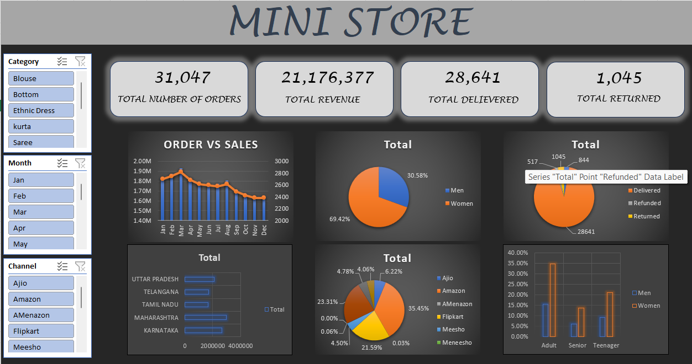

# 🛍️ Mini Store Sales Dashboard

An interactive **Microsoft Excel Sales Dashboard** built to analyze retail sales performance using Pivot Tables, Pivot Charts, KPIs, Slicers, and Excel formulas. The dashboard provides actionable insights into revenue, orders, customer demographics, sales channels, and regional performance.

## 📊 Dashboard Preview

## 🚀 Features

* Interactive dashboard with dynamic slicers
* Revenue and order tracking
* Monthly Sales vs Orders analysis
* Order status monitoring (Delivered, Returned, Cancelled, Refunded)
* Gender-wise sales analysis
* Top-performing states
* Sales channel performance
* Customer age group analysis
* KPI cards for quick business insights

## 🛠️ Tools Used

* Microsoft Excel
* Pivot Tables
* Pivot Charts
* Slicers
* Excel Formulas
* Conditional Formatting
* Dashboard Design

## 📈 Key KPIs

* Total Orders
* Total Revenue
* Total Delivered Orders
* Total Returned Orders

## 📂 Files Included

* `Mini_Store_Sales_Dashboard.xlsx` – Interactive Excel dashboard
* `dashboard.png` – Dashboard preview
* `README.md` – Project documentation

## 🎯 Business Insights

* Track sales performance over time
* Identify top-performing products and regions
* Monitor order fulfillment status
* Analyze customer demographics
* Support data-driven business decisions

## 📌 Skills Demonstrated

* Data Analysis
* Data Visualization
* Dashboard Development
* Business Intelligence
* KPI Reporting
* Sales Analytics
* Microsoft Excel

---

⭐ If you found this project useful, feel free to star the repository!
